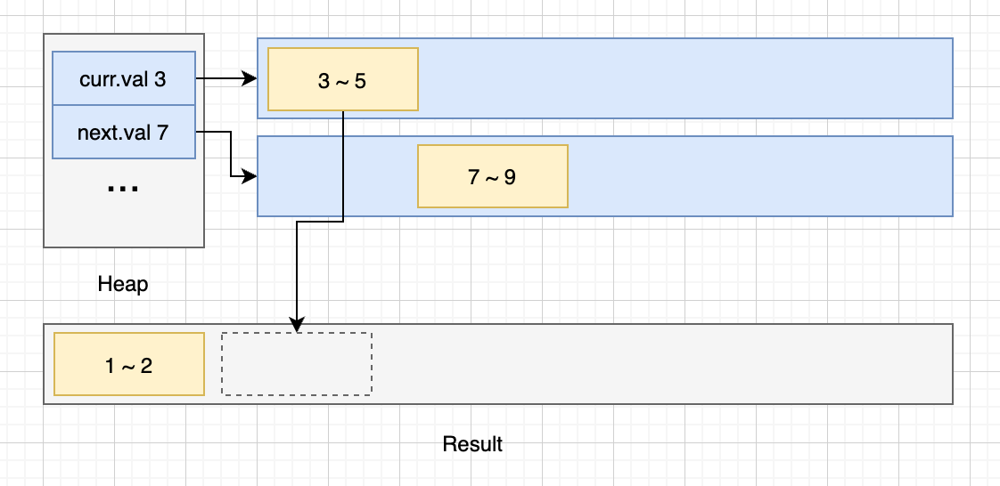
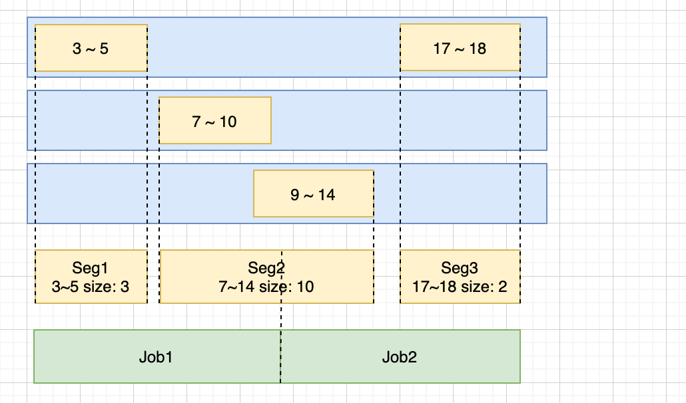

# 数据块排序
## 1 文件目录
```
├── README.md  项目说明
├── doc        文档相关，图片
├── go.mod
├── go.sum
└── merger     代码实现
    ├── merger.go      合并器实现
    ├── merger_test.go 合并器用例
    ├── part.go        数据类型定义
    └── part_test.go   数据类型用例
```
## 2 主要类型
### 2.1 数据相关([part.go](merger/part.go))
- DataBlock: 数据块，uint64数组
- Part: 分区，由一组不想交的DataBlock顺序构成
- PartCursor: 分区游标，辅助读取分区数据
### 2.2 合并器实现([merger.go](merger/merger.go))
- PartMerger: 分区合并器接口定义
- BaseMerger: 基础合并器
- ConcurrentMerger: 并发合并器，切分任务后多个协程并行合并后汇总结果

## 3 算法思路
### 3.1 基础合并
基础合并主要是单线程进行分区合并的实现，基本思路是将分区头放入堆中，
每次取出头部值最小的分区将其头部数值合入结果中。

因为分区中每个数据块是有序且不相交的，如果每次取出在放入堆中，
如果遇到一个数据块存在大量连续的数值时会存在反复加入堆又取出的消耗。

优化思路是通过在当前分区进行二分查找，找到小于下一个分区头部指的所有数据一次性取出，减少反复入堆的消耗。
如下图所示：



### 3.2 并发合并
因为数据块是有序的，所以可以将整个分区合并任务分为多个子任务并发进行合并，从而在多核下优化效率。

本身单线程任务逻辑跟基础合并思路一样，主要问题在于如何将任务均匀的拆分成多个子任务：
- 思路1：把每一个需要合并的分区均匀分段后，每个线程合并大小相等的一组子分区。
优点是每个线程负载一样，缺点，每组任务的合并结果可能相交，需要再合并一次，
这样整体还需要主线程最后进行一次遍历。
- 思路2：计算出所有分区的数据的分部情况，假设数据在每段中分布得相对均匀根据比例拆分任务。
优点，拆分出来的任务不相交，最后只需要简单拼接，缺点，如果数据分部极端不均匀，每个子任务量差距较大。

个人理解该题的设计思路是lsm存储的分区合并，这种场景下主键通常不会特别不均匀，所以采用思路2。如下图所示：


